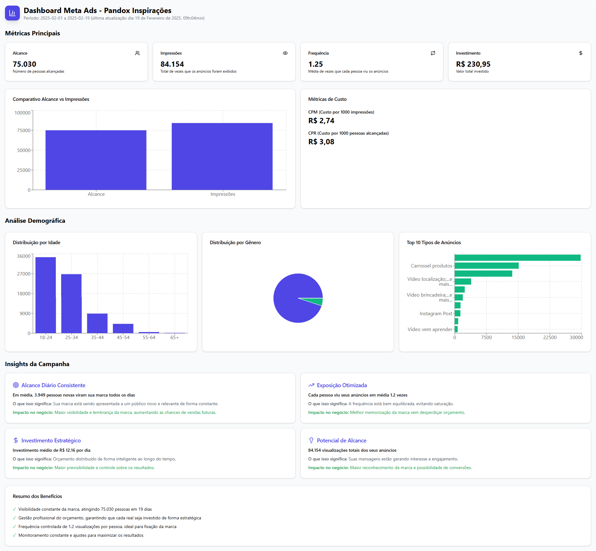

# Meta Ads Dashboard - Pandox Inspirações

Dashboard interativo para visualização e análise de dados de campanhas do Meta Ads (Facebook/Instagram).



## Funcionalidades

- 📊 Visualização de métricas principais (Alcance, Impressões, Frequência, Investimento)
- 📈 Análise demográfica detalhada (Idade, Gênero)
- 💰 Métricas de custo (CPM, CPR)
- 📱 Design responsivo
- 🎯 Insights de performance da campanha
- 📋 Análise de tipos de anúncios

## Tecnologias Utilizadas

- React com TypeScript
- Tailwind CSS para estilização
- Recharts para gráficos
- ShadcN UI para componentes
- Lodash para manipulação de dados

## Como Executar

1. Clone o repositório
```bash
git clone https://github.com/sammarxz/dashboard-meta-ads-pandox.git
```

2. Instale as dependências
```bash
npm install
```

3. Execute o projeto
```bash
npm run dev
```

4. Acesse `http://localhost:5173`

## Estrutura do Projeto

```
src/
├── components/        # Componentes React
├── hooks/             # Hooks customizados
├── utils/             # Funções utilitárias
├── constants/         # Valores constantes para o projeto
├── types/             # Definições de tipos TypeScript
```

## Funcionalidades do Dashboard

### Métricas Principais
- Visualização de KPIs essenciais
- Comparativo entre alcance e impressões
- Análise de custos por mil (CPM/CPR)

### Análise Demográfica
- Distribuição por faixa etária
- Distribuição por gênero
- Top 10 tipos de anúncios mais efetivos

### Insights
- Análise de performance
- Recomendações estratégicas
- Métricas de eficiência

## Contato

Para mais informações sobre gestão de tráfego pago, entre em contato via WhatsApp:
[Falar com Gestor](https://wa.me/5581992480658)